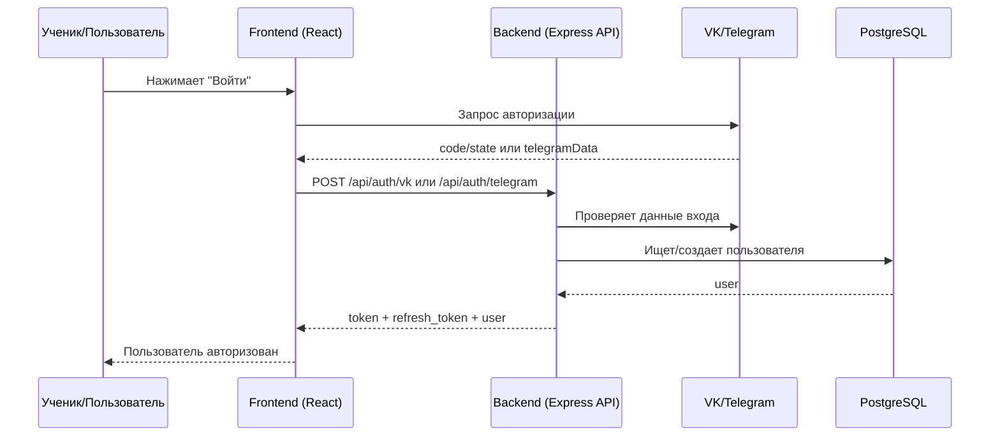
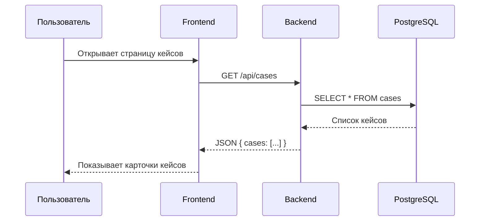
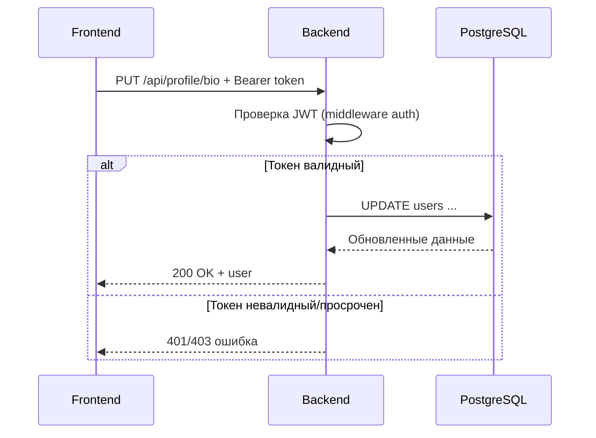
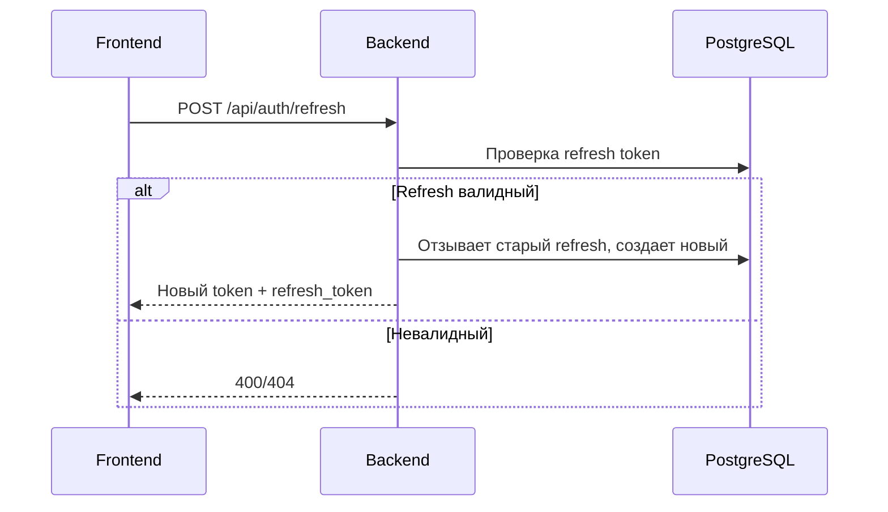
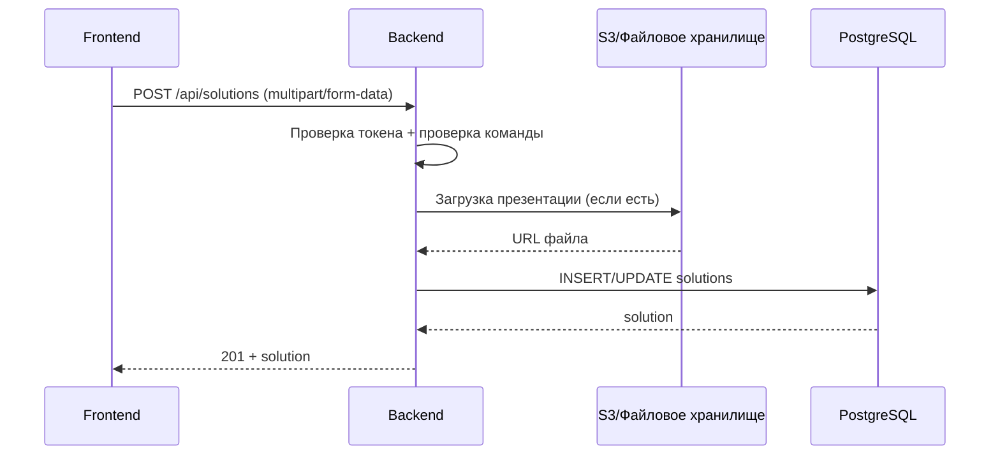
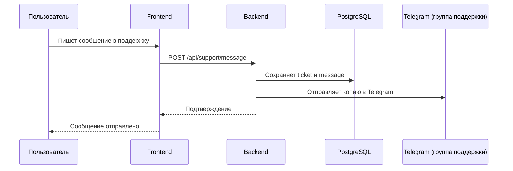

# Как фронт и бэк общаются (простыми словами)

Ниже схемы для объяснения школьникам: что происходит, когда пользователь нажимает кнопки на сайте.

## 1) Вход в систему

Коротко:
- фронт не "доверяет сам себе", он всегда просит бэк подтвердить вход;
- бэк проверяет внешние сервисы (VK/Telegram) и только потом выдает JWT.

## 2) Получение данных (например, кейсов)

## 3) Защищенный запрос (профиль, команда, админка)

## 4) Когда токен истекает

## 5) Отправка решения командой

## 6) Поддержка (чат с пользователем)

## Главная идея для школьников

- `Frontend` — это "красивый интерфейс и кнопки".
- `Backend` — это "мозг и правила безопасности".
- `Database` — это "память проекта".
- Пользователь видит только фронт, но все важные проверки делает бэк.
